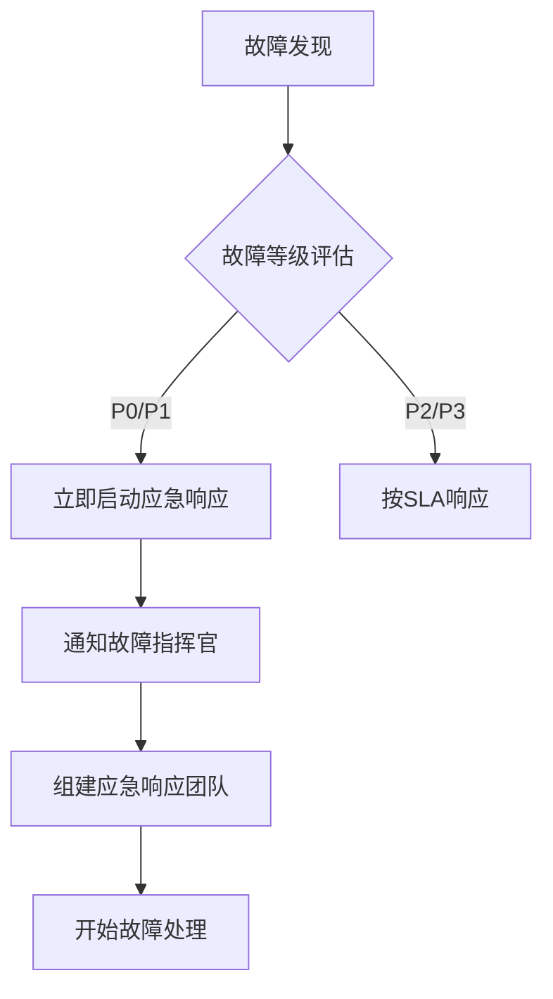
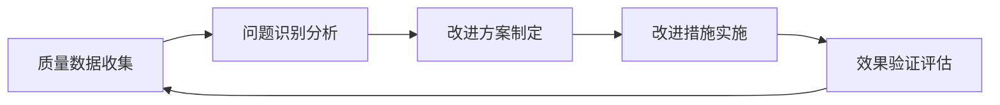
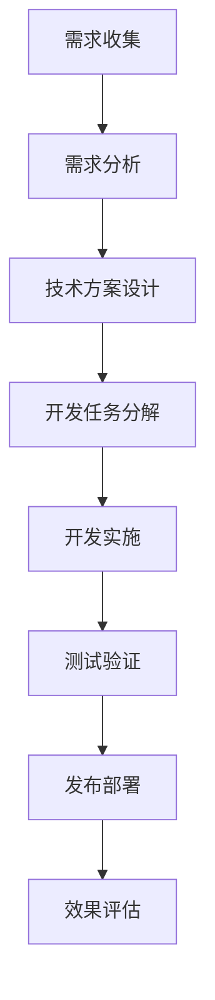
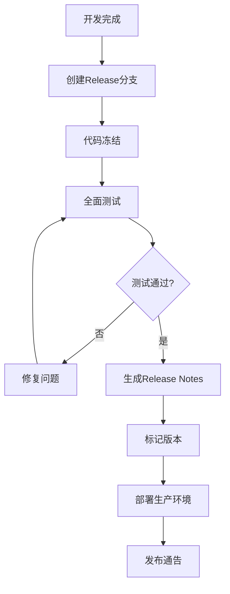

# 青少年心理健康AI教练平台 - 开源项目质量保障方案

## 1. 概述

本文档定义了青少年心理健康AI教练训练平台的全面质量保障体系，基于Google SRE最佳实践和Anthropic AI模型评估标准，确保平台的可靠性、安全性和代码质量。

### 项目背景
- **核心功能一**：支持心理学专家对家长-教练对话模拟数据进行心理学维度评分，作为AI模型训练基线
- **核心功能二**：支持AI提示词工程师提供提示词，通过评估AI打分PK选取最优提示词
- **技术栈**：TypeScript + Python + Next.js + Hono框架
- **部署环境**：阿里云人工部署
- **模型集成**：DeepSeek、Gemini、Claude、OpenAI、Qwen等商业API

## 2. 平台核心功能 SLI 标准与用户交互质量标准

### 2.1 服务级别指标（SLI）

#### 2.1.1 心理学专家打分模块
| 指标类别 | 指标名称 | 目标值 / 阈值 | 测量方法 |
|----------|----------|--------------|----------|
| 可用性 | 模块可用率 | ≥ 99.9% | 通过服务健康检查（HTTP 200/OK），统计每分钟可用率 |
| 延迟 | 响应时间 P95 | < 2 秒 | 接口监控工具（如 Prometheus + Grafana）记录 API 请求耗时分布 |
| 正确性 | 打分保存成功率 | ≥ 99.99% | 后端日志统计打分提交成功次数 / 总提交次数 |
| 数据一致性 | 打分内容与样本绑定一致率 | 100% | 通过定期数据库校验（ID 关联检查） |

---

#### 2.1.2 提示词工程师评估模块
| 指标类别 | 指标名称 | 目标值 / 阈值 | 测量方法 |
|----------|----------|--------------|----------|
| 可用性 | 模块可用率 | ≥ 99% | 健康检查接口监控 |
| 延迟 | 评估任务完成时间 P95 | < 120 秒 | 队列任务监控（任务创建时间与完成时间差） |
| 正确性 | 评分生成成功率 | ≥ 99% | API 调用成功次数 / 总调用次数 |
| 数据一致性 | 排行榜更新延迟 | ≤ 5 分钟 | 数据更新时间戳检查 |

---

#### 2.1.3 安全与合规指标（全局）
| 指标类别 | 指标名称 | 目标值 / 阈值 | 测量方法 |
|----------|----------|--------------|----------|
| 隐私保护 | 敏感数据脱敏覆盖率 | 100% | 代码扫描（检测敏感信息输出位置）+ 测试数据审查 |
| 提示词合规 | 非法或违规提示词拦截率 | ≥ 99% | 调用 LLM 过滤 API + 定期人工抽检 |
| 审计追踪 | 关键操作审计记录率 | 100% | 后端日志与数据库审计表对比 |

---

### 2.2 用户交互质量标准

#### 2.2.1 打分界面（心理学专家）
- **易用性**：打分表单结构清晰，字段标签符合心理学问卷习惯
- **反馈性**：提交后即时显示保存成功/失败提示（<1秒）
- **可访问性**：支持无障碍访问（WCAG 2.1 AA 级别）
- **稳定性**：页面在连续 30 分钟操作内无卡顿或崩溃

---

#### 2.2.2 提示词编辑与评估界面（提示词工程师）
- **编辑体验**：代码/文本编辑器支持高亮、自动保存、版本回滚
- **评分透明度**：评分来源（模型、参数）在界面中可见
- **排行榜可读性**：支持按分数、时间排序；数据实时性 ≤ 5 分钟
- **输入验证**：禁止提交空内容或明显违规提示词

---

#### 2.2.3 通用交互标准
- **一致性**：全站按钮、颜色、排版统一
- **响应速度**：界面主要操作交互延迟 ≤ 300ms
- **错误提示**：错误信息明确（包含原因与建议解决方法）
- **国际化**：支持中英文切换
---


## 3. 代码质量保障体系

### 3.1 分支管理规范

#### 3.1.1 GitFlow分支策略
```
main/master     # 生产环境分支，只接受来自release分支的合并
develop         # 开发主分支，集成所有feature分支
feature/*       # 功能开发分支，从develop分支创建
release/*       # 发布准备分支，从develop分支创建
hotfix/*        # 紧急修复分支，从main分支创建
```

#### 3.1.2 分支命名规范
```
feature/功能模块-简短描述    # feature/expert-rating-system
hotfix/问题类型-简短描述     # hotfix/security-api-auth
release/版本号              # release/v1.2.0
```

#### 3.1.3 提交信息规范
遵循Conventional Commits标准：
```
<type>[可选scope]: <description>

[可选body]

[可选footer]
```

类型定义：
- `feat`: 新功能
- `fix`: 错误修复
- `docs`: 文档更新
- `style`: 代码格式化
- `refactor`: 代码重构
- `test`: 添加测试
- `chore`: 构建过程或辅助工具的变动
- `security`: 安全相关修复

### 3.2 代码质量检查要求

#### 3.2.1 静态代码分析工具配置

**TypeScript/JavaScript 项目**：
```json
// .eslintrc.js
{
  "extends": [
    "@typescript-eslint/recommended",
    "prettier",
    "plugin:security/recommended"
  ],
  "rules": {
    "complexity": ["error", 10],
    "max-lines-per-function": ["error", 50],
    "no-console": "warn",
    "security/detect-sql-injection": "error"
  }
}
```

**Python 项目**：
```yaml
# .pre-commit-config.yaml
repos:
  - repo: https://github.com/psf/black
    rev: 23.1.0
    hooks:
      - id: black
  - repo: https://github.com/pycqa/flake8
    rev: 6.0.0
    hooks:
      - id: flake8
        args: [--max-line-length=88, --max-complexity=10]
  - repo: https://github.com/pycqa/bandit
    rev: 1.7.4
    hooks:
      - id: bandit
        args: [-ll, -x, tests/]
```

#### 3.2.2 代码质量门禁标准
- **代码覆盖率**：单元测试覆盖率 ≥80%，核心业务逻辑覆盖率 ≥90%
- **圈复杂度**：单个函数圈复杂度 ≤10
- **代码重复率**：代码重复率 ≤5%
- **安全漏洞**：高风险安全漏洞数量 = 0，中风险漏洞 ≤3个
- **技术债务**：SonarQube技术债务比率 ≤5%

### 3.3 项目架构合理性检查

#### 3.3.1 架构层次检查
```
presentation/     # 表现层：Next.js页面和组件
├── pages/        # 页面路由
├── components/   # 可复用组件
└── hooks/        # 自定义hooks

business/         # 业务层：业务逻辑处理
├── services/     # 业务服务
├── models/       # 业务模型
└── validators/   # 数据验证

infrastructure/   # 基础设施层
├── api/          # API接口（Hono）
├── database/     # 数据库操作
├── external/     # 外部服务集成
└── utils/        # 工具函数
```

#### 3.3.2 依赖关系检查
- 表现层只能依赖业务层
- 业务层只能依赖基础设施层
- 禁止循环依赖
- 外部API依赖必须通过适配器模式封装

#### 3.3.3 模块化检查规范
- 每个模块必须有明确的职责边界
- 模块间通信通过明确定义的接口
- 核心业务逻辑与外部依赖解耦
- 单个文件代码行数 ≤300行

### 3.4 PR & Code Review 要求

#### 3.4.1 PR创建标准
- **PR标题**：遵循提交信息规范，清晰描述变更内容
- **PR描述**：必须包含以下内容
  ```markdown
  ## 变更说明
  - 简要描述本次变更的目的和内容
  
  ## 测试说明
  - 单元测试覆盖情况
  - 集成测试执行结果
  - 手工测试验证点
  
  ## 风险评估
  - 潜在影响范围
  - 回滚方案
  
  ## Checklist
  - [ ] 代码符合项目编码规范
  - [ ] 已添加必要的单元测试
  - [ ] 已更新相关文档
  - [ ] 已通过所有CI检查
  ```

#### 3.4.2 Code Review检查点
- **功能正确性**：代码逻辑是否正确实现需求
- **安全性**：是否存在安全漏洞，特别关注AI模型调用安全
- **性能**：是否存在性能问题，特别关注API调用优化
- **可维护性**：代码是否易于理解和维护
- **测试完整性**：测试用例是否充分覆盖变更内容

#### 3.4.3 审核流程
- **自动化检查**：所有CI检查必须通过
- **同行审核**：至少需要1名同级开发者审核通过
- **技术负责人审核**：涉及架构变更或核心业务逻辑需要技术负责人审核
- **安全审核**：涉及安全相关变更需要安全专家审核

## 4. 项目部署全链路质量监控

### 4.1 部署流水线质量门禁

#### 4.1.1 构建阶段检查
```yaml
# CI/CD Pipeline - Build Stage
build:
  stage: build
  script:
    - npm run lint          # 代码规范检查
    - npm run type-check    # TypeScript类型检查
    - npm run test:unit     # 单元测试
    - npm run build         # 构建检查
  coverage: '/Lines\s*:\s*(\d+\.\d+)%/'
  artifacts:
    reports:
      junit: junit.xml
      coverage_report:
        coverage_format: cobertura
        path: coverage/cobertura-coverage.xml
```

#### 4.1.2 安全扫描阶段
```yaml
security:
  stage: security
  script:
    - npm audit --audit-level high    # 依赖安全检查
    - docker run --rm -v $(pwd):/app sonarqube-scanner    # 代码安全扫描
    - python -m bandit -r . -f json -o bandit-report.json  # Python安全扫描
  artifacts:
    reports:
      security: bandit-report.json
```

#### 4.1.3 部署前质量检查
- **环境健康检查**：目标环境资源状态检查
- **依赖服务检查**：数据库、外部API服务可用性检查
- **配置验证**：环境配置参数有效性验证
- **回滚准备**：确保回滚方案可执行

### 4.2 运行时监控体系

#### 4.2.1 应用性能监控（APM）
```typescript
// 性能监控指标
interface PerformanceMetrics {
  responseTime: number;     // 响应时间 <200ms
  throughput: number;       // 吞吐量 >100 req/s
  errorRate: number;        // 错误率 <1%
  cpuUsage: number;         // CPU使用率 <70%
  memoryUsage: number;      // 内存使用率 <80%
}
```

#### 4.2.2 AI模型调用监控
```typescript
interface ModelMetrics {
  apiLatency: number;           // API调用延迟 <3s
  apiSuccessRate: number;       // API成功率 >99%
  tokenUsage: number;           // Token消耗监控
  modelQualityScore: number;    // 模型回复质量实时评分
  costPerRequest: number;       // 单次请求成本
}
```

#### 4.2.3 业务指标监控
```typescript
interface BusinessMetrics {
  expertRatingAccuracy: number;     // 专家评分准确性
  promptEngineEffectiveness: number; // 提示词工程效果
  userSatisfactionScore: number;    // 用户满意度评分
  systemAvailability: number;      // 系统可用性 >99.9%
}
```

### 4.3 日志和追踪体系

#### 4.3.1 结构化日志规范
```typescript
interface LogEntry {
  timestamp: string;
  level: 'DEBUG' | 'INFO' | 'WARN' | 'ERROR';
  service: string;
  userId?: string;
  sessionId: string;
  operation: string;
  message: string;
  metadata?: Record<string, any>;
  traceId: string;
}
```

#### 4.3.2 分布式追踪
- **请求追踪**：从前端用户操作到AI模型调用的完整链路追踪
- **性能分析**：识别性能瓶颈和优化点
- **错误追踪**：快速定位和诊断错误根因

### 4.4 告警体系

#### 4.4.1 告警等级定义
- **P0 - 紧急**：服务完全不可用，影响所有用户
- **P1 - 严重**：核心功能异常，影响大部分用户
- **P2 - 重要**：部分功能异常，影响部分用户
- **P3 - 一般**：轻微问题，不影响核心功能

#### 4.4.2 告警规则配置
```yaml
alerts:
  - name: HighErrorRate
    condition: error_rate > 0.05
    for: 5m
    severity: P1
    
  - name: HighResponseTime
    condition: response_time_p95 > 2000ms
    for: 3m
    severity: P2
    
  - name: AIModelFailure
    condition: model_api_success_rate < 0.95
    for: 2m
    severity: P1
```

## 5. 故障分级协作SOP

### 5.1 故障等级定义

#### 5.1.1 P0级故障 - 紧急
**影响范围**：服务完全不可用或存在严重安全风险
**响应时间**：立即响应（5分钟内）
**恢复目标**：30分钟内恢复服务

**触发条件**：
- 平台完全无法访问
- 数据泄露或安全漏洞被利用
- AI模型给出有害建议（涉及自伤等）
- 核心业务功能完全失效

#### 5.1.2 P1级故障 - 严重
**影响范围**：核心功能异常，影响大部分用户
**响应时间**：15分钟内响应
**恢复目标**：2小时内恢复服务

**触发条件**：
- 专家评分系统故障
- AI模型API调用失败率 >10%
- 用户认证系统异常
- 数据库连接异常

#### 5.1.3 P2级故障 - 重要
**影响范围**：部分功能异常，影响部分用户
**响应时间**：1小时内响应
**恢复目标**：8小时内恢复服务

**触发条件**：
- 特定页面加载异常
- 部分AI模型调用失败
- 非核心功能模块故障
- 性能显著下降

#### 5.1.4 P3级故障 - 一般
**影响范围**：轻微问题，不影响核心功能
**响应时间**：24小时内响应
**恢复目标**：72小时内修复

### 5.2 故障响应流程

#### 5.2.1 故障发现与报告


#### 5.2.2 应急响应团队角色

**故障指挥官（Incident Commander）**：
- 整体协调故障处理过程
- 决策优先级和资源分配
- 对外沟通和状态同步

**技术负责人（Technical Lead）**：
- 技术诊断和修复方案制定
- 协调技术团队执行修复
- 评估技术风险和影响

**沟通协调员（Communications Lead）**：
- 内部团队沟通协调
- 用户和利益相关者沟通
- 文档记录和状态更新

### 5.3 故障处理流程

#### 5.3.1 故障诊断步骤
1. **现象确认**：确认故障现象和影响范围
2. **日志分析**：分析相关日志和监控数据
3. **组件检查**：逐个检查系统组件状态
4. **外部依赖**：检查AI模型API等外部服务
5. **根因分析**：确定故障根本原因

#### 5.3.2 恢复操作优先级
1. **立即止损**：阻止故障扩散
2. **服务恢复**：优先恢复核心功能
3. **数据保护**：确保数据完整性和安全性
4. **用户通知**：及时告知用户当前状况

#### 5.3.3 故障恢复验证
- **功能验证**：确认核心功能正常运行
- **性能验证**：确认系统性能符合SLA
- **安全验证**：确认无安全风险残留
- **用户验证**：确认用户可以正常使用

### 5.4 故障后处理

#### 5.4.1 故障总结报告
```markdown
# 故障总结报告

## 故障概述
- 故障等级：P1
- 发生时间：2024-XX-XX XX:XX:XX
- 恢复时间：2024-XX-XX XX:XX:XX
- 影响时长：XX分钟
- 影响范围：描述受影响的功能和用户

## 故障时间线
- XX:XX 故障开始
- XX:XX 故障发现
- XX:XX 应急响应启动
- XX:XX 根因确定
- XX:XX 修复措施实施
- XX:XX 服务恢复

## 根因分析
详细描述故障的根本原因

## 修复措施
描述采取的修复措施

## 预防措施
- 短期措施：防止相同问题再次发生
- 长期措施：系统性改进建议

## 经验教训
总结从本次故障中获得的经验和教训
```

#### 5.4.2 改进行动计划
- **技术改进**：系统架构和代码优化
- **流程改进**：监控、告警和响应流程优化
- **人员培训**：团队技能提升和演练

## 6. 开源项目安全性保障

### 6.1 数据安全保护

#### 6.1.1 敏感数据分类
```typescript
enum DataSensitivityLevel {
  PUBLIC = 0,      // 公开数据
  INTERNAL = 1,    // 内部数据
  CONFIDENTIAL = 2, // 机密数据（用户个人信息）
  RESTRICTED = 3   // 限制级数据（心理健康数据）
}
```

#### 6.1.2 数据保护措施
- **加密存储**：敏感数据采用AES-256加密存储
- **传输加密**：所有数据传输使用TLS 1.3
- **访问控制**：基于角色的细粒度权限控制
- **数据脱敏**：测试环境数据脱敏处理
- **数据留存**：明确数据保留期限和销毁流程

#### 6.1.3 隐私保护合规
- **GDPR合规**：支持用户数据导出和删除权利
- **数据最小化**：只收集必要的数据
- **同意管理**：明确的用户同意机制
- **数据匿名化**：研究数据去标识化处理

### 6.2 访问控制与认证

#### 6.2.1 身份认证体系
```typescript
interface AuthenticationConfig {
  mfa: boolean;                    // 多因素认证
  passwordPolicy: {
    minLength: 12;
    requireUppercase: true;
    requireLowercase: true;
    requireNumbers: true;
    requireSpecialChars: true;
  };
  sessionTimeout: number;          // 会话超时时间
  maxFailedAttempts: number;       // 最大失败尝试次数
}
```

#### 6.2.2 权限管理模型
```typescript
enum UserRole {
  ADMIN = 'admin',           // 系统管理员
  EXPERT = 'expert',         // 心理学专家
  ENGINEER = 'engineer',     // AI工程师
  VIEWER = 'viewer'          // 观察者
}

interface Permission {
  resource: string;          // 资源类型
  action: string;           // 操作类型
  conditions?: object;      // 附加条件
}
```

#### 6.2.3 API安全保护
- **API密钥管理**：定期轮换API密钥
- **请求限流**：防止API滥用
- **输入验证**：严格的输入参数验证
- **输出过滤**：敏感信息输出过滤

### 6.3 代码安全保障

#### 6.3.1 安全开发规范
- **安全编码标准**：遵循OWASP安全编码规范
- **依赖管理**：定期更新和安全扫描第三方依赖
- **密钥管理**：禁止在代码中硬编码密钥
- **安全配置**：生产环境安全配置检查

#### 6.3.2 安全测试要求
```yaml
security_tests:
  - name: "依赖漏洞扫描"
    tool: "npm audit / safety check"
    frequency: "每次构建"
    
  - name: "静态安全分析"
    tool: "SonarQube / Bandit"
    frequency: "每次提交"
    
  - name: "动态安全测试"
    tool: "OWASP ZAP"
    frequency: "发版前"
    
  - name: "渗透测试"
    tool: "专业安全团队"
    frequency: "季度"
```

#### 6.3.3 安全漏洞处理流程
1. **漏洞发现**：通过安全扫描或报告发现漏洞
2. **风险评估**：评估漏洞风险等级和影响范围
3. **修复计划**：制定修复时间表和方案
4. **修复实施**：开发和测试安全修复
5. **验证确认**：验证漏洞已被有效修复
6. **经验总结**：分析漏洞原因和预防措施

### 6.4 AI模型安全保障

#### 6.4.1 模型调用安全
```typescript
interface ModelSecurityConfig {
  apiKeyRotation: number;          // API密钥轮换周期(天)
  requestValidation: boolean;       // 请求内容验证
  responseFiltering: boolean;       // 响应内容过滤
  rateLimiting: {
    requestsPerMinute: number;
    tokensPerDay: number;
  };
}
```

#### 6.4.2 内容安全检查
- **输入过滤**：过滤恶意或不当输入内容
- **输出审核**：AI回复内容安全性检查
- **有害内容检测**：识别可能有害的建议
- **偏见检测**：检测和缓解AI模型偏见

#### 6.4.3 模型使用监控
- **异常检测**：识别异常的API调用模式
- **内容监控**：监控生成内容的质量和安全性
- **成本控制**：防止API调用成本失控
- **合规检查**：确保模型使用符合相关法规

## 7. 质量度量与持续改进

### 7.1 质量指标体系

#### 7.1.1 代码质量指标
```typescript
interface CodeQualityMetrics {
  testCoverage: number;           // 测试覆盖率目标: >80%
  codeComplexity: number;         // 平均圈复杂度目标: <10
  duplicationRate: number;        // 代码重复率目标: <5%
  technicalDebt: number;          // 技术债务比率目标: <5%
  securityHotspots: number;       // 安全热点数量目标: 0
  maintainabilityIndex: number;   // 可维护性指数目标: >70
}
```

#### 7.1.2 服务质量指标
```typescript
interface ServiceQualityMetrics {
  availability: number;           // 可用性目标: >99.9%
  responseTime: number;           // 响应时间目标: <200ms
  errorRate: number;              // 错误率目标: <1%
  mttr: number;                   // 平均恢复时间目标: <30min
  mtbf: number;                   // 平均故障间隔目标: >720h
}
```

#### 7.1.3 业务质量指标
```typescript
interface BusinessQualityMetrics {
  modelAccuracy: number;          // 模型准确性目标: >85%
  userSatisfaction: number;       // 用户满意度目标: >4.0/5.0
  expertAgreementRate: number;    // 专家一致性目标: >80%
  promptEffectiveness: number;    // 提示词有效性目标: >75%
  safetyComplianceRate: number;   // 安全合规率目标: 100%
}
```

### 7.2 质量数据收集

#### 7.2.1 自动化质量数据收集
```yaml
quality_data_collection:
  code_metrics:
    source: "SonarQube API"
    frequency: "每次构建"
    retention: "6个月"
    
  performance_metrics:
    source: "APM工具"
    frequency: "实时"
    retention: "3个月"
    
  business_metrics:
    source: "应用内埋点"
    frequency: "实时"
    retention: "1年"
```

#### 7.2.2 质量报告生成
- **日报**：关键质量指标趋势
- **周报**：质量问题汇总和分析
- **月报**：质量改进成效评估
- **季报**：质量体系完善建议

### 7.3 持续改进机制

#### 7.3.1 质量改进闭环


#### 7.3.2 改进优先级评估
```typescript
interface ImprovementPriority {
  impact: 'HIGH' | 'MEDIUM' | 'LOW';      // 影响程度
  effort: 'HIGH' | 'MEDIUM' | 'LOW';      // 实施难度
  urgency: 'HIGH' | 'MEDIUM' | 'LOW';     // 紧急程度
  riskLevel: 'HIGH' | 'MEDIUM' | 'LOW';   // 风险等级
}
```

#### 7.3.3 改进措施跟踪
- **改进任务管理**：使用GitHub Issues跟踪改进任务
- **进度监控**：定期检查改进措施执行进度
- **效果评估**：量化评估改进措施的效果
- **经验分享**：总结和分享改进经验

## 8. 工具链和自动化

### 8.1 开发工具链

#### 8.1.1 代码质量工具
```yaml
code_quality_tools:
  linting:
    typescript: "ESLint + @typescript-eslint"
    python: "flake8 + black + isort"
    
  security:
    typescript: "eslint-plugin-security"
    python: "bandit + safety"
    
  testing:
    unit_test: "Jest + pytest"
    integration_test: "Cypress + pytest"
    
  coverage:
    tool: "Istanbul + Coverage.py"
    threshold: 80%
```

#### 8.1.2 CI/CD流水线
```yaml
# .github/workflows/quality-check.yml
name: Quality Check

on: [push, pull_request]

jobs:
  code-quality:
    runs-on: ubuntu-latest
    steps:
      - uses: actions/checkout@v3
      
      - name: Setup Node.js
        uses: actions/setup-node@v3
        with:
          node-version: '18'
          cache: 'npm'
          
      - name: Install dependencies
        run: npm ci
        
      - name: Lint check
        run: npm run lint
        
      - name: Type check
        run: npm run type-check
        
      - name: Unit tests
        run: npm run test:coverage
        
      - name: Security scan
        run: npm audit --audit-level high
        
      - name: Upload coverage
        uses: codecov/codecov-action@v3
```

#### 8.1.3 自动化部署流水线
```yaml
deployment_pipeline:
  stages:
    - build_and_test
    - security_scan
    - deploy_staging
    - integration_test
    - deploy_production
    - post_deployment_check
    
  rollback_strategy:
    automatic: true
    triggers:
      - error_rate > 5%
      - response_time > 5s
      - availability < 99%
```

### 8.2 监控和告警工具

#### 8.2.1 监控工具栈
```yaml
monitoring_stack:
  metrics:
    collection: "Prometheus"
    visualization: "Grafana"
    alerting: "AlertManager"
    
  logging:
    collection: "Fluentd"
    storage: "Elasticsearch"
    visualization: "Kibana"
    
  tracing:
    tool: "Jaeger"
    sampling_rate: "1%"
    
  apm:
    tool: "New Relic / DataDog"
    features:
      - application_performance
      - error_tracking
      - database_monitoring
```

#### 8.2.2 自定义监控指标
```typescript
// 自定义业务监控指标
const businessMetrics = {
  // AI模型相关指标
  model_api_latency: histogram({
    name: 'model_api_request_duration_seconds',
    help: 'AI模型API请求延迟',
    buckets: [0.1, 0.5, 1, 2, 5, 10]
  }),
  
  model_quality_score: gauge({
    name: 'model_response_quality_score',
    help: 'AI模型回复质量评分'
  }),
  
  // 专家评分相关指标
  expert_rating_accuracy: gauge({
    name: 'expert_rating_accuracy_rate',
    help: '专家评分准确性'
  }),
  
  // 系统安全指标
  security_violations: counter({
    name: 'security_violations_total',
    help: '安全违规事件总数'
  })
};
```

## 9. 团队协作和知识管理

### 9.1 协作流程规范

#### 9.1.1 需求管理流程


#### 9.1.2 代码协作规范
- **分支策略**：严格遵循GitFlow工作流
- **提交规范**：使用Conventional Commits规范
- **代码审查**：强制性同行代码审查
- **文档同步**：代码变更同步更新文档

### 9.2 知识管理体系

#### 9.2.1 文档分类管理
```
docs/
├── architecture/          # 架构设计文档
│   ├── system-design.md
│   ├── api-specification.md
│   └── database-schema.md
├── development/           # 开发指南
│   ├── setup-guide.md
│   ├── coding-standards.md
│   └── testing-guide.md
├── operations/            # 运维文档
│   ├── deployment-guide.md
│   ├── monitoring-guide.md
│   └── troubleshooting.md
├── security/              # 安全文档
│   ├── security-policy.md
│   ├── threat-model.md
│   └── incident-response.md
└── quality/               # 质量保障文档
    ├── quality-standards.md
    ├── testing-strategy.md
    └── metrics-definition.md
```

#### 9.2.2 知识传承机制
- **技术分享会**：定期技术经验分享
- **文档回顾**：定期文档更新和回顾
- **mentor制度**：新人导师制度
- **最佳实践库**：积累和分享最佳实践

### 9.3 社区协作管理

#### 9.3.1 贡献者指南
```markdown
# 贡献者指南

## 如何开始贡献
1. Fork项目到个人GitHub
2. 创建功能分支
3. 进行开发和测试
4. 提交Pull Request
5. 等待代码审查和合并

## 贡献类型
- 🐛 Bug修复
- ✨ 新功能开发
- 📝 文档完善
- 🎨 UI/UX改进
- ⚡ 性能优化
- 🔒 安全增强

## 质量要求
- 代码必须通过所有质量检查
- 新功能必须包含测试用例
- 需要更新相关文档
- 遵循项目编码规范
```

#### 9.3.2 社区管理规范
- **行为准则**：明确的社区行为准则
- **沟通渠道**：GitHub Issues、Discussions、微信群
- **定期会议**：月度社区同步会议
- **贡献认可**：贡献者认可和激励机制

## 10. 应急预案和业务连续性

### 10.1 业务连续性计划

#### 10.1.1 关键业务识别
```typescript
interface CriticalBusiness {
  expertRatingSystem: {
    rto: '2小时';        // 恢复时间目标
    rpo: '15分钟';       // 恢复点目标
    priority: 'HIGH';
  };
  
  promptEngineering: {
    rto: '4小时';
    rpo: '30分钟';
    priority: 'HIGH';
  };
  
  userManagement: {
    rto: '1小时';
    rpo: '5分钟';
    priority: 'CRITICAL';
  };
  
  dataAnalytics: {
    rto: '24小时';
    rpo: '4小时';
    priority: 'MEDIUM';
  };
}
```

#### 10.1.2 备份和恢复策略
```yaml
backup_strategy:
  database:
    type: "增量备份"
    frequency: "每小时"
    retention: "30天"
    location: "阿里云OSS + 异地备份"
    
  application_data:
    type: "全量备份"
    frequency: "每日"
    retention: "90天"
    encryption: "AES-256"
    
  configuration:
    type: "版本控制"
    frequency: "实时"
    retention: "永久"
    location: "Git仓库"
```

#### 10.1.3 灾难恢复流程
1. **灾难评估**：评估影响范围和恢复优先级
2. **团队召集**：召集应急响应团队
3. **系统隔离**：隔离受影响系统防止扩散
4. **数据恢复**：从备份恢复关键数据
5. **服务重建**：重建关键业务服务
6. **功能验证**：验证恢复的服务功能
7. **业务切换**：将流量切换到恢复的服务
8. **持续监控**：密切监控系统稳定性

### 10.2 外部依赖风险管理

#### 10.2.1 AI模型API风险缓解
```typescript
interface ModelAPIRiskMitigation {
  multiProvider: {
    primary: 'OpenAI GPT-4';
    secondary: ['Claude', 'Gemini', 'DeepSeek'];
    failover: 'automatic';
  };
  
  rateLimitManagement: {
    quotaMonitoring: true;
    adaptiveThrottling: true;
    queueing: true;
  };
  
  costControl: {
    dailyBudget: number;
    alertThreshold: 80;
    autoStop: true;
  };
}
```

#### 10.2.2 云服务依赖管理
- **多可用区部署**：分布在不同可用区
- **CDN加速**：使用CDN加速静态资源
- **DNS故障转移**：配置DNS故障转移
- **监控告警**：密切监控云服务状态

## 11. 合规性和审计

### 11.1 数据保护合规

#### 11.1.1 GDPR合规要求
```typescript
interface GDPRCompliance {
  dataProcessingBasis: {
    consent: boolean;           // 用户同意
    legitimateInterest: boolean; // 合法利益
    contractual: boolean;       // 合同需要
  };
  
  userRights: {
    dataAccess: boolean;        // 数据访问权
    dataPortability: boolean;   // 数据可携权
    dataErasure: boolean;       // 删除权
    rectification: boolean;     // 更正权
  };
  
  dataProtection: {
    encryptionAtRest: boolean;  // 静态加密
    encryptionInTransit: boolean; // 传输加密
    accessControl: boolean;     // 访问控制
    auditLog: boolean;         // 审计日志
  };
}
```

#### 11.1.2 心理健康数据特殊保护
- **敏感数据标识**：明确标识心理健康相关数据
- **专门的保护措施**：更严格的访问控制和加密
- **有限的处理目的**：仅用于模型训练和改进
- **定期数据审计**：定期审查数据使用情况

### 11.2 安全审计体系

#### 11.2.1 审计日志要求
```typescript
interface AuditLog {
  timestamp: string;          // 时间戳
  userId: string;            // 用户ID
  action: string;            // 操作类型
  resource: string;          // 资源标识
  sourceIP: string;          // 来源IP
  userAgent: string;         // 用户代理
  result: 'SUCCESS' | 'FAILURE'; // 操作结果
  details: object;           // 详细信息
  riskLevel: 'LOW' | 'MEDIUM' | 'HIGH'; // 风险等级
}
```

#### 11.2.2 定期安全审计
```yaml
security_audit_schedule:
  internal_audit:
    frequency: "月度"
    scope: "代码安全、配置审查、权限检查"
    
  external_audit:
    frequency: "季度"
    scope: "渗透测试、安全架构评估"
    
  compliance_audit:
    frequency: "年度"
    scope: "法规合规性、数据保护"
    
  emergency_audit:
    trigger: "安全事件发生后"
    scope: "事件调查、影响评估"
```

## 12. 版本发布和变更管理

### 12.1 版本发布策略

#### 12.1.1 语义化版本控制
```
版本格式：MAJOR.MINOR.PATCH

MAJOR: 不兼容的API变更
MINOR: 向下兼容的功能性新增
PATCH: 向下兼容的问题修正

例如：v1.2.3
- v1.x.x: 主要版本，可能包含破坏性变更
- v1.2.x: 功能版本，新增功能但保持兼容
- v1.2.3: 修复版本，bug修复和小改进
```

#### 12.1.2 发布流程


#### 12.1.3 发布验收标准
- **功能完整性**：所有计划功能已实现
- **质量门禁**：通过所有质量检查
- **安全验证**：通过安全扫描和测试
- **性能测试**：满足性能要求
- **文档完整性**：文档已更新

### 12.2 变更管理流程

#### 12.2.1 变更分类
```typescript
enum ChangeType {
  EMERGENCY = 'emergency',    // 紧急变更（安全修复）
  STANDARD = 'standard',      // 标准变更（功能发布）
  NORMAL = 'normal',          // 常规变更（优化改进）
  LOW_RISK = 'low-risk'       // 低风险变更（文档更新）
}

interface ChangeRequest {
  type: ChangeType;
  description: string;
  riskAssessment: string;
  rollbackPlan: string;
  approvers: string[];
  implementationDate: Date;
}
```

#### 12.2.2 变更审批流程
- **提交申请**：详细的变更申请
- **风险评估**：技术和业务风险评估
- **审批流程**：根据变更级别确定审批人
- **实施计划**：详细的实施和回滚计划
- **实施监控**：变更实施过程监控

## 结语

本质量保障方案为青少年心理健康AI教练平台提供了全面的质量管理框架，涵盖了从代码开发到生产运行的完整生命周期。方案的成功实施需要团队的共同努力和持续改进。

### 实施建议

1. **分阶段实施**：根据项目当前状况，分阶段实施各项质量保障措施
2. **工具先行**：优先搭建自动化工具链，提高质量保障效率
3. **文化建设**：培养团队的质量意识和安全意识
4. **持续优化**：基于实践反馈持续优化质量保障体系

### 相关文档链接

- [GitHub代码质量维护操作指南](./github-quality-maintenance-guide.md)
- [GitHub协作效率提升工具指南](./github-collaboration-tools-guide.md)
- [AI模型质量评估详细指南](./ai-model-quality-evaluation-guide.md)
- [安全事件响应手册](./security-incident-response-handbook.md)

---

**文档版本**: v1.0  
**最后更新**: 2025-08-11  